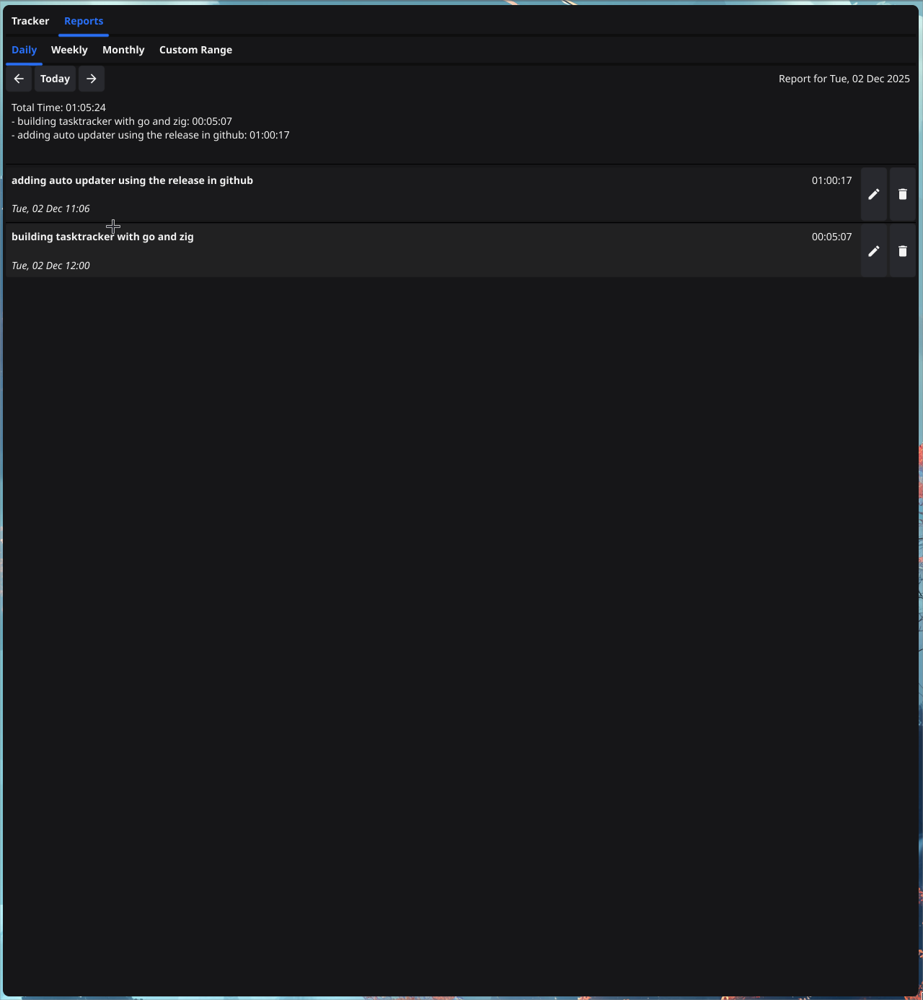
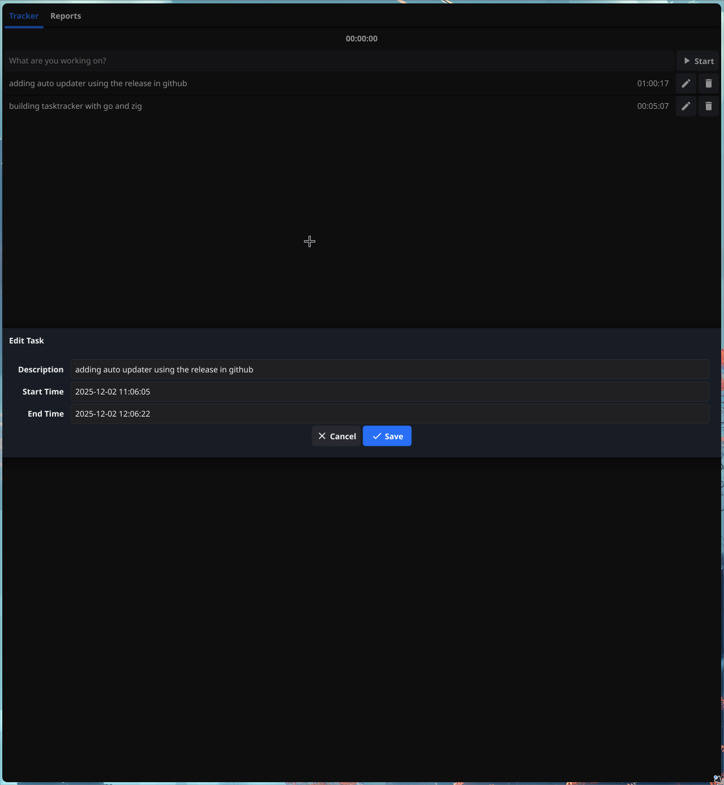
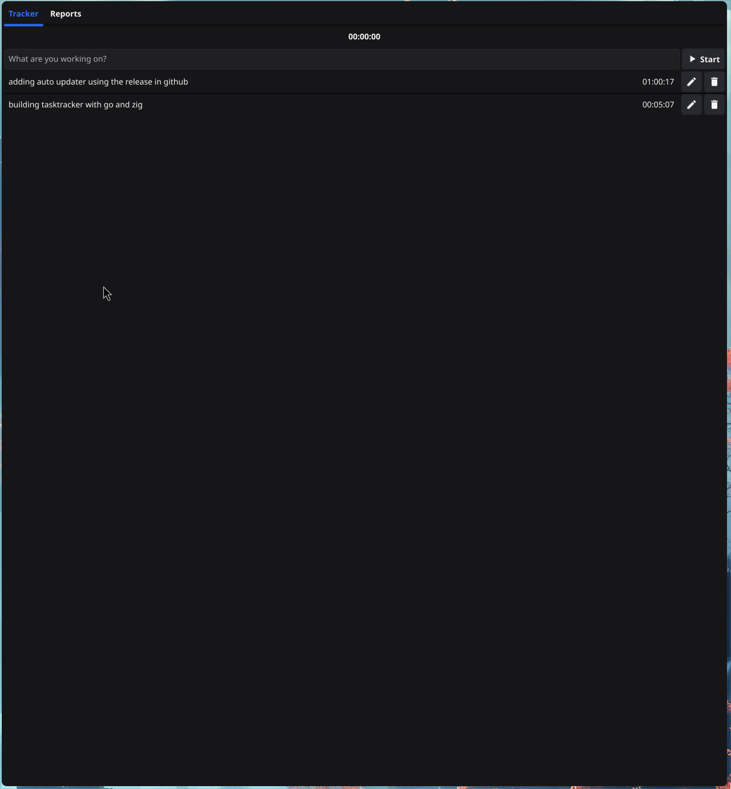

# TaskTracker

TaskTracker is a simple command-line application for tracking tasks.

## Features

- **Time Tracking**: Start, pause, and stop tasks easily.
- **Data Persistence**: Tasks are saved locally in JSON format.
- **Reports**: View daily, weekly, and monthly summaries.
    - **Grouping**: Organize your reports by Day or Week with automatic subtotals.
    - **Custom Range**: specific date ranges analysis.
    - **PDF Export**: Generate professional PDF reports of your current view, respecting active filters and grouping.

## Building the application

To build the application, make sure you have Go installed and then run the following command in the project's root directory:

```bash
go build -o tasktracker ./cmd/tasktracker
```

## Running the application

After building, you can run the application from the project root:

```bash
./tasktracker
```

## Usage

### Tracker
- Enter a task description and click "Start" (Play icon) to begin tracking.
- Use "Pause" to temporarily stop the timer.
- "Stop" finishes the task and saves it to history.

### Reports
- Navigate to the **Reports** tab to view your history.
- Select **Daily**, **Weekly**, **Monthly**, or **Custom Range**.
- Use the **Group By** dropdown to organize tasks (e.g., group weekly tasks by day).
- Click the **Export PDF** button (floppy disk icon) to save the current report as a PDF file.

## Screenshots



