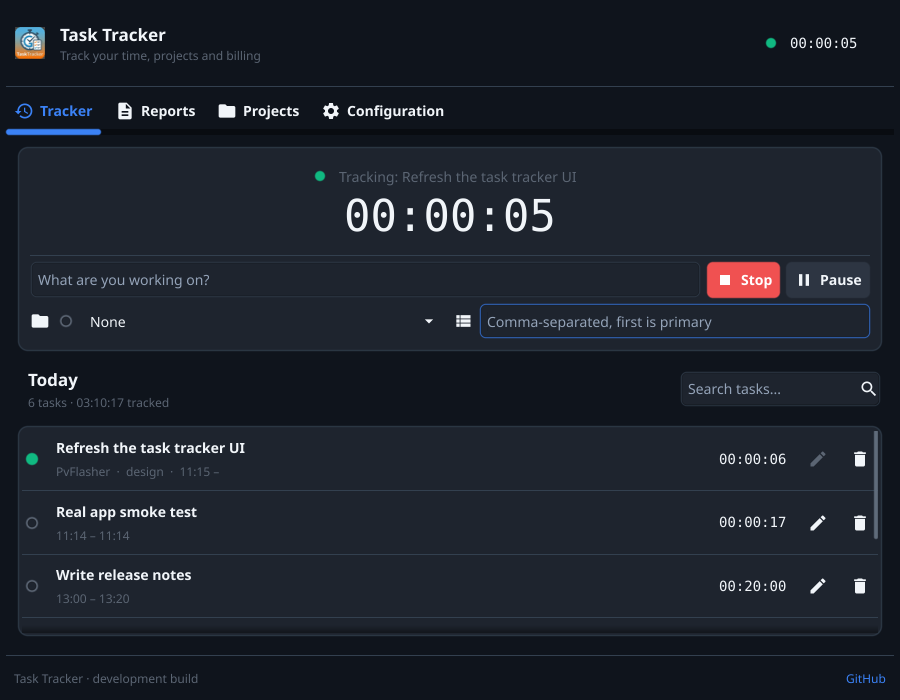
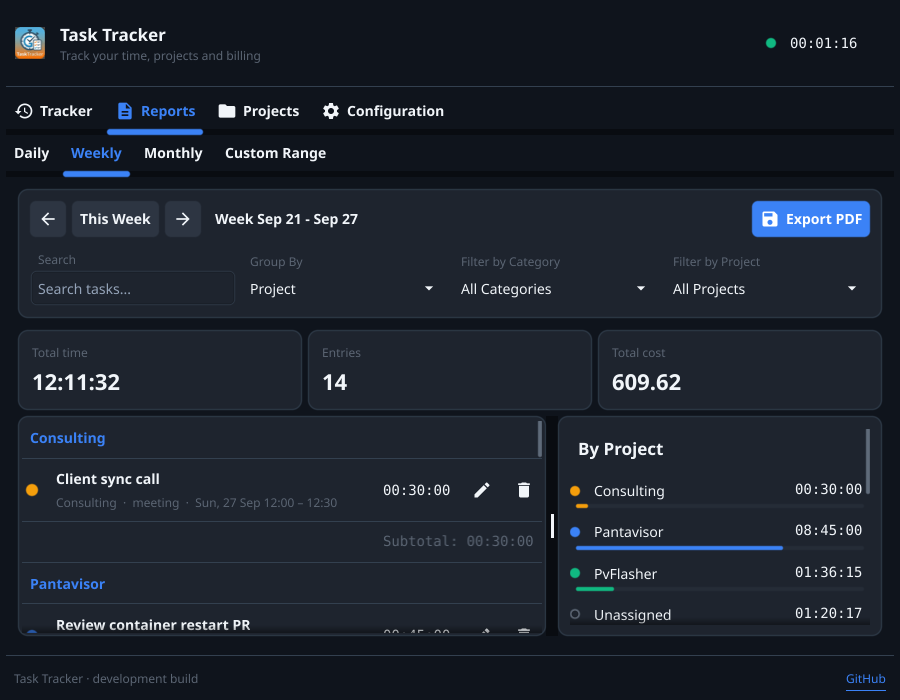
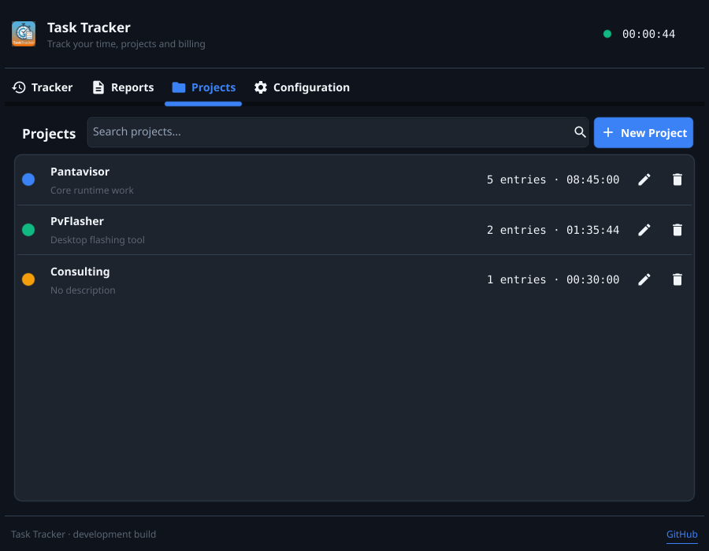

# TaskTracker

TaskTracker is a simple command-line application for tracking tasks.

## Features

- **Time Tracking**: Start, pause, and stop tasks easily.
- **Data Persistence**: Tasks are saved locally in JSON format.
- **Reports**: View daily, weekly, and monthly summaries.
    - **Grouping**: Organize your reports by Day or Week with automatic subtotals.
    - **Custom Range**: specific date ranges analysis.
    - **PDF Export**: Generate professional PDF reports of your current view, respecting active filters and grouping.

## Building the application

To build the application, make sure you have Go installed and then run the following command in the project's root directory:

```bash
go build -o tasktracker ./cmd/tasktracker
```

## Running the application

After building, you can run the application from the project root:

```bash
./tasktracker
```

## Usage

### Tracker
- Enter a task description and click "Start" (Play icon) to begin tracking.
- Use "Pause" to temporarily stop the timer.
- "Stop" finishes the task and saves it to history.

### Reports
- Navigate to the **Reports** tab to view your history.
- Select **Daily**, **Weekly**, **Monthly**, or **Custom Range**.
- Use the **Group By** dropdown to organize tasks (e.g., group weekly tasks by day).
- Click the **Export PDF** button (floppy disk icon) to save the current report as a PDF file.

### Appearance
- Choose **Follow system**, **Light** or **Dark** under **Configuration → Appearance**. The choice applies immediately and is saved in the config file (`theme`).

### Updates
- Task Tracker checks for a new release once a day and offers it with its release notes: **Install and Restart**, **Later** or **Skip This Version**. A running timer keeps counting through the restart.
- **Configuration → Updates** shows the current and latest versions, checks again on demand and turns the automatic check off.
- Updates are signed and verified before they are installed. Copies installed with Flatpak or a package manager, or in a folder you can't write to, are told about new releases but updated by those means.

## Releases and self-updates (maintainers)

Pushing a `v*` tag builds every package and creates the GitHub release (`.github/workflows/release.yml`). For stable tags the release job also runs `tools/updater`, which signs each update bundle (Linux `.tar.xz`, Windows and macOS `.zip`; not the Flatpak tarballs) with minisign and publishes `latest.json` in [Tauri's updater format](https://v2.tauri.app/plugin/updater/). The app reads it from `releases/latest/download/latest.json` (`internal/update`), the same scheme as pvflasher.

- **Signing key**: the minisign private key is the `UPDATER_PRIVATE_KEY` repository secret (base64-encoded key file, like Tauri). The matching public key is compiled into `internal/update/pubkey.go`. Keep a backup of the private key: without it, installed copies can't receive updates. The release job fails if the secret is missing or doesn't match `pubkey.go`, so no build ships with a key nobody holds.
- **Creating the key** (once, before the first release with this updater):
  1. `make updater-key` writes the private key to `~/.tasktracker-updater/updater.key` (`UPDATER_KEY_DIR=…` to choose another folder; an existing key is never overwritten) and puts the public key in `internal/update/pubkey.go`.
  2. Commit `internal/update/pubkey.go`.
  3. Add the contents of `updater.key` as the `UPDATER_PRIVATE_KEY` repository secret (Settings → Secrets and variables → Actions), and back the file up somewhere safe.
- **Downgrade protection**: each signature's trusted comment carries `file:` and `version:`, and the app refuses a bundle whose signed file name or version doesn't match the manifest.
- **Asset names**: keep `tasktracker-<os>-<arch>.tar.xz` / `.zip`. Releases up to v0.1.4 update themselves by picking assets by name, which is how they move to this updater; that is also why the `.sig` files are not published.
- **Testing a release**: point a build at another manifest with `TASKTRACKER_UPDATE_MANIFEST=http://…/latest.json`; bundles must still be signed with the release key. Development builds (versions that aren't a plain tag) never update.
- Wait for a release's workflow to finish before tagging the next one, so `releases/latest` points at the newest version.

## Screenshots



